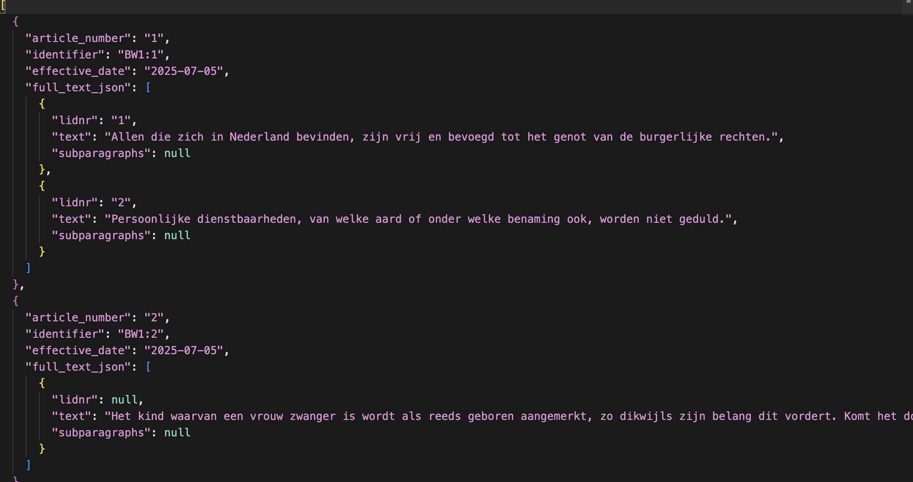

[](https://www.python.org/downloads/)
[](./LICENSE)
[](https://pypi.org/project/lxml/)
[](https://github.com/KimchiLegal/Wettenparser/commits/main)

# Wettenparser

A Dutch law XML-to-JSON parser for extracting articles, paragraphs, and metadata from wetten.overheid.nl XML files.

---

## Table of Contents

- [Features](#features)
- [Installation](#installation)
- [Usage](#usage)
  - [Interactive Version](#1-interactive-version-wettenparserpy)
  - [Straight-to-the-Point Version](#2-straight-to-the-point-version-wettenparsershortpy)
- [Sample Output](#sample-output)
- [How to Get XML Data](#how-to-get-xml-data)
- [Example XML Structure](#example-xml-structure)
- [What the Parser Extracts](#what-the-parser-extracts)
- [Output Example](#output-example)
- [License](#license)

---

## Features

- Converts Dutch legal XML (from wetten.overheid.nl) to JSON
- Extracts articles, paragraphs, subparagraphs, and metadata
- Outputs ready-to-import data for databases or further processing

---

## Installation

Install the required dependencies using the provided requirements file:

```bash
pip install -r requirements.txt
```

_Note: The requirements.txt file is now included in the repository._

---

## Usage

### 1. Interactive Version (`wettenparser.py`)
- Guides you through file selection and output naming.
- Asks for the law code interactively.
- Handles errors and missing files gracefully.
- Recommended for general users.

**Usage:**
```bash
python3 wettenparser.py
```
You will be prompted to select an XML file and enter a law code.

Or, provide arguments directly:
```bash
python3 wettenparser.py <path_to_xml_file> <output_json_file>
```

---

### 2. Straight-to-the-Point Version (`wettenparser_short.py`)
- Minimal, non-interactive script.
- Requires XML file path and law code as command-line arguments.
- Outputs to `parsed_articles.json` in the current directory.
- Minimal error handling, assumes well-formed input.
- Recommended for automation or advanced users.

**Usage:**
```bash
python3 wettenparser_short.py <path_to_xml_file> <law_code>
```

---

## Sample Output

Below is an example of the output generated by this parser:



The `sample/` folder contains example outputs generated by this parser, including:

- Boek 1 Burgerlijk Wetboek
- Boek 2 Burgerlijk Wetboek
- Boek 3 Burgerlijk Wetboek
- Wetboek van Strafrecht

These samples demonstrate the structure and quality of the parsed JSON data.

---

## How to Get XML Data

1. Go to [wetten.overheid.nl](https://wetten.overheid.nl/xmlpad.cgi)
2. Search for the law you want (e.g., "Burgerlijk Wetboek Boek 1")
3. Click on the law, then look for the "Download" or "XML" link
4. Download the XML file (e.g., `BWBR0002656_2024-01-01_0.xml`)
5. Place the XML file in the same directory as this parser

---

## Example XML Structure

```xml
<regeling inwerkingtreding="2024-01-01">
  <boek>
    <kop>
      <label>Boek 1</label>
      <titel>Personen- en Familierecht</titel>
    </kop>
    <titeldeel>
      <kop>
        <label>Titel 1</label>
        <titel>Definities</titel>
      </kop>
      <artikel id="BW1-1">
        <kop>
          <nr>1</nr>
        </kop>
        <lid>
          <lidnr>1</lidnr>
          <al>In dit boek wordt verstaan onder ...</al>
        </lid>
      </artikel>
    </titeldeel>
  </boek>
</regeling>
```

---

## What the Parser Extracts

- **article_number**: The article number (e.g., `1`)
- **identifier**: Law code + article number (e.g., `BW1:1`)
- **effective_date**: From the root XML attribute
- **full_text_json**: List of paragraphs/lids and subparagraphs

---

## Output Example

```json
[
  {
    "article_number": "1",
    "identifier": "BW1:1",
    "effective_date": "2024-01-01",
    "full_text_json": [
      {
        "lidnr": "1",
        "text": "In dit boek wordt verstaan onder ...",
        "subparagraphs": null
      }
    ]
  }
]
```

---

## Contributing

Contributions, issues, and feature requests are welcome!
Feel free to check the [issues page](https://github.com/KimchiLegal/Wettenparser/issues) or submit a pull request.

---

## License

This project is licensed under the MIT License - see the [LICENSE](LICENSE) file for details. 